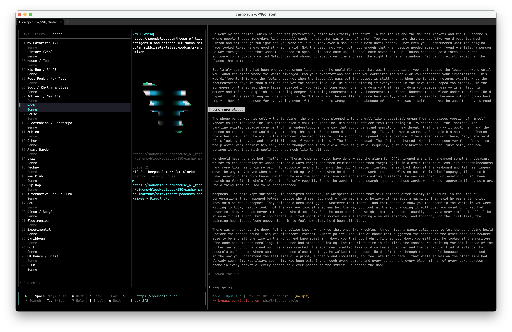

# clisten

A terminal UI for discovering and playing music from [NTS Radio](https://www.nts.live). Browse live streams, curated picks, and search by genre — all from your terminal.

Built with Rust, [ratatui](https://github.com/ratatui/ratatui), and [mpv](https://mpv.io).



## Features

- **Live streams** — tune into NTS channels 1 & 2 in real-time
- **Curated picks** — browse NTS editorial selections
- **Genre search** — explore 120+ genres, server-side filtered
- **Queue management** — build playlists, reorder, play next; persisted across sessions
- **Direct URL playback** — paste any stream URL to play
- **mpv backend** — robust audio playback via IPC

## Requirements

| Dependency | Purpose | Install |
|---|---|---|
| [mpv](https://mpv.io) | Audio playback | `brew install mpv` |

## Install

```sh
brew install pepijnsenders/tap/clisten
```

Or download a prebuilt binary from the [latest release](https://github.com/PepijnSenders/clisten/releases/latest), or build from source:

```sh
git clone https://github.com/PepijnSenders/clisten.git
cd clisten
cargo install --path .
```

## Usage

```sh
clisten
```

## Keybindings

| Key | Action |
|---|---|
| `j` / `k` | Scroll down / up |
| `Enter` | Play selected item / select genre |
| `Space` | Play / Pause |
| `n` / `p` | Next / Previous track |
| `s` | Stop playback |
| `a` | Add to queue |
| `A` | Add to queue (play next) |
| `d` | Remove current track from queue |
| `c` | Clear queue |
| `← →` | Seek ±5s (accelerates on repeat) |
| `t` | Open seek timeline |
| `v` | Cycle visualizer |
| `i` | Toggle skip NTS intro |
| `Tab` / `Shift+Tab` | Cycle sub-tabs |
| `1` `2` `3` | Jump to Live / Picks / Search |
| `/` | Focus search bar |
| `o` | Open direct URL player |
| `[` / `]` | Volume down / up |
| `r` | Retry failed request |
| `Esc` | Back / unfocus |
| `?` | Help |
| `q` | Quit |

## Configuration

Optional config file at `~/.config/clisten/config.toml`:

```toml
[general]
frame_rate = 30.0  # TUI refresh rate (fps)
```

Queue state is stored in `~/.local/share/clisten/clisten.db`.

## Troubleshooting

**No audio / playback not starting**
- Verify mpv is installed: `mpv --version`
- Test mpv directly: `mpv https://stream-relay-geo.ntslive.net/stream`
- If using yt-dlp URLs (SoundCloud, Mixcloud, etc.), ensure yt-dlp is installed: `brew install yt-dlp`

**Blank screen or rendering glitches**
- Resize the terminal window — clisten needs at least ~80×24
- Try a different terminal emulator (iTerm2, Alacritty, kitty all work well)

**Stale config or broken state**
- Reset everything: `rm -rf ~/.config/clisten`
- This removes your config and re-triggers the onboarding wizard on next launch
- Your queue is stored separately in `~/.local/share/clisten/` and is not affected

**Database issues**
- Reset the database: `rm ~/.local/share/clisten/clisten.db`
- This clears your saved queue

**Re-run the onboarding wizard**
- Press `?` to open help, then press `Enter`

## Development

```sh
cargo build          # compile
cargo test           # run all unit + integration tests
cargo clippy         # lint
cargo fmt --check    # check formatting
```

## Releasing

1. **Bump the version** in `Cargo.toml` and commit.
2. **Create a GitHub release** with a `v`-prefixed tag (e.g. `v0.2.0`):
   ```sh
   gh release create v0.2.0 --title "v0.2.0" --generate-notes
   ```
   The release workflow builds binaries for macOS (Intel + ARM) and Linux, packages them as `.tar.gz` archives, and uploads them as release assets. It then automatically updates the Homebrew formula in `pepijnsenders/homebrew-tap` with the new version and SHA256 hashes.
3. **Verify**: `brew update && brew upgrade clisten` (or `brew install pepijnsenders/tap/clisten` for first-time users).

## License

MIT
